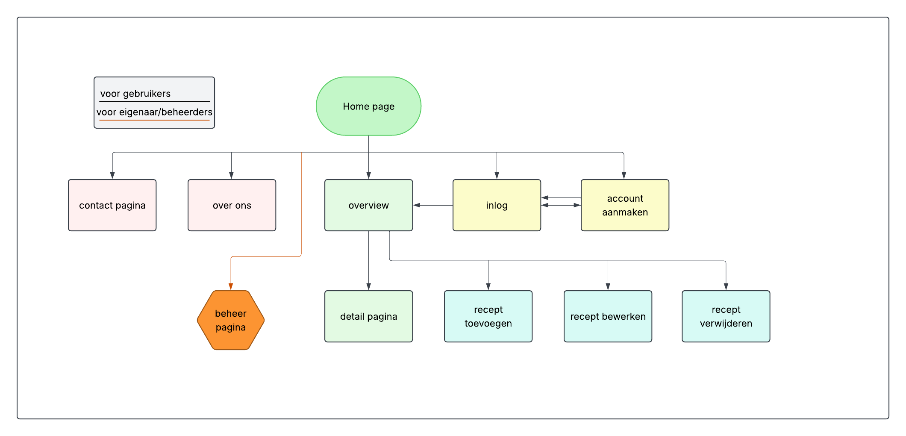

## HMW-vragen
In dit document worden de resultaten en vragen weergegeven naar wat wij het beste voor het project vonden.

## Concepten

Zoals er in eerdere documenten werd uitgelegd, hebben jongeren behoefte aan simpliciteit en comfort. Bovendien hebben zij ook mentale druk, tijdsnood en vinden zij voordeel in goedkope dingen. Het is daardoor erg belangrijk om veel aandacht hieraan te houden zodat het project niet flopt na weken harde werk. Hierbij de volgende concepten:
* **Concept 1:** Een kleurrijke, simpele en toch profesioneel-lijkende webapp waarbij gebruikers recepten snel, gemakkelijk em goedkoop kunnen overnemen en met een eigen account ook meerdere recepten kunnen plaatsen

* **Concept 2:** Een voorgemaakte, professionele- en toch simpel-lijkende kookboek met een mix tussen klassieke en samenhangde stijlen waarin jongeren kort en krachtig via de internet recepten kunnen overnemen die zich regelmatig update

Wij vonden allemaal dat het eerste concept het allerbeste was, aangezien dat jongeren hun eigen recepten  op het webapp kunnen plaatsen. Bovendien past het hoogstwaarschijnlijk beter bij jongeren qua styling en staan zij hoogstwaarschijnlijk niet meerdere maanden te wachten voordat er een aantal recepten worden toegeveogd wanneer zij dat zelf kunnen delen bij het gekozen concept.

Hieronder kunt u de site map van het website vinden om een betere beeld te kunnen geven van hoe het website qua pagina's zal werken.
## Site map
