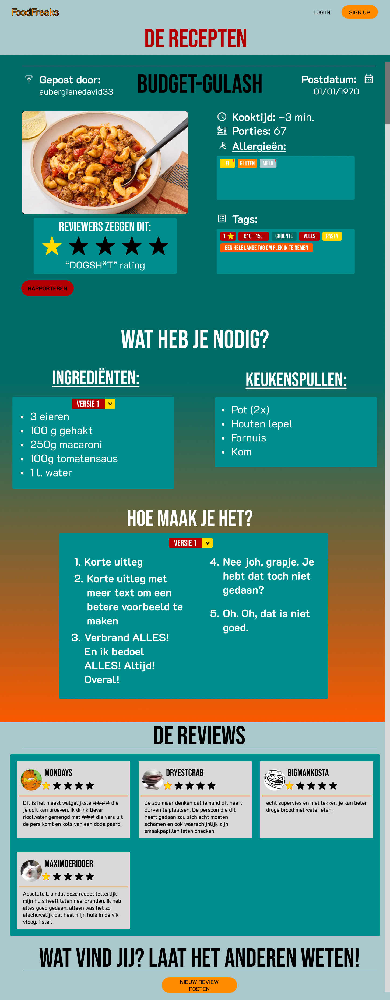

## De prototype
Hier worden de designs en het algemene digitale architectuur van het website weergetoond.

Hieronder vindt u een aantal wireframes, de hi-fi designs en wat wij het beste vinden voor het project qua front- en backend.

## Wireframes

.jpg)
.jpg)

## Hi-Fi

## Tech-architecture
* **Frontend:** HTML, CSS, TailwindCSS
* **Backend/Data:** SQLite, PHP, JavaScript, SQL, JSON

Voor de front-end is er uiteraard HTML en CSS nodig, aangezien zij voor de styling en bouw van (bijna) alle websites en webapps. Aangezien dat er in deze TailwindCSS project zal worden gebruikt via HTML-classes, zal CSS hoogstwaarschijnlijk wat minder worden gebruikt.

Voor de back-end zal er PHP worden gebruikt, zowel als SQL en SQlite om databases en pagina's goed met elkaar te kunnen koppelen met bepaalde software. Wellicht zal JSON ook hiervoor worden gebruikt, maar wat het voor zal dienen is nu op dit moment niet helder. Ondanks dat, hebbben wij een goede beeld van hoe het webapp eruit zal komen te zien.

## MVP
Er lijken hier geen problemen te zijn die nadelen zullen hebben voor de klant.